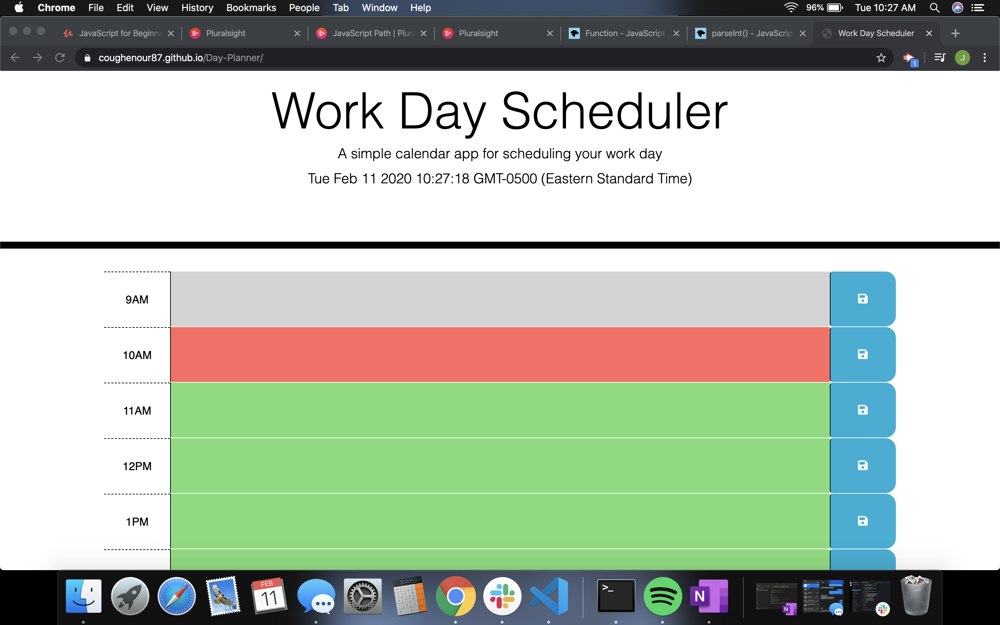

 

[Deployed Website](https://github.com/Coughenour87/Day-Planner)

* The application displays timeblocks for standard business hours (9 a.m. to 5 p.m.).

* Each timeblock contains an input field and save button.

* Clicking a timeblock's "Save" button stores the input text in local storage, allowing the text to persist when the application is refreshed.

* The current day is displayed at the top of the calendar.

* Each hour should be color coded to reflect past, present, or future for that time slot.

